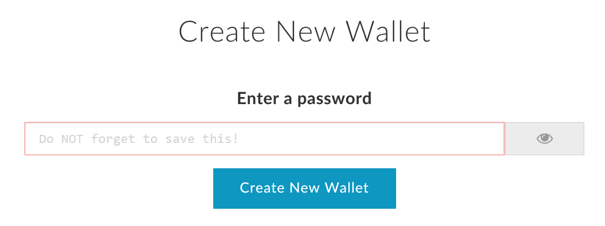
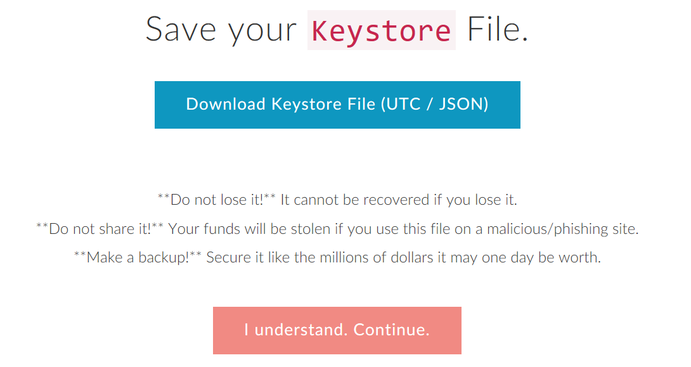
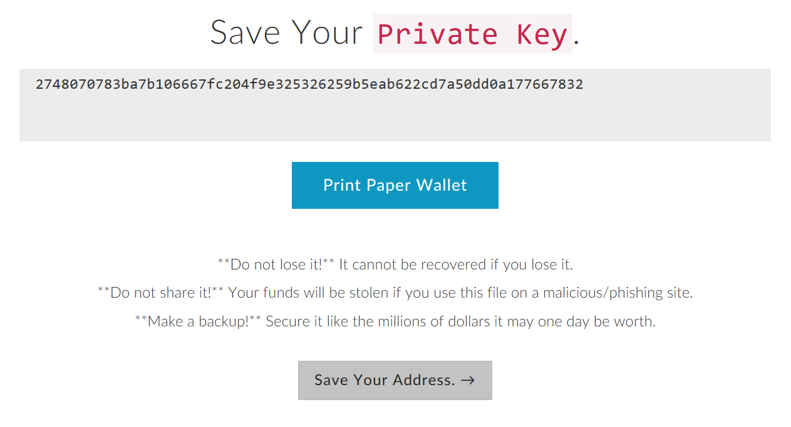
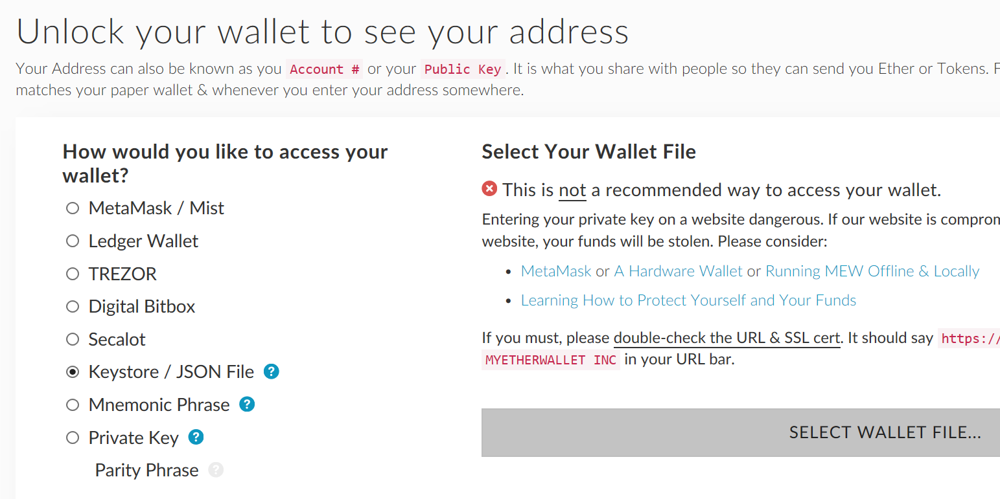
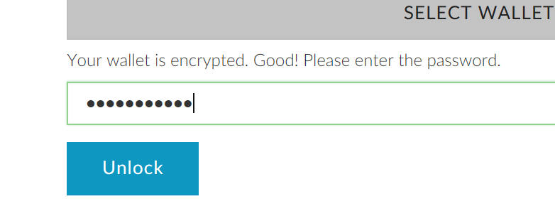
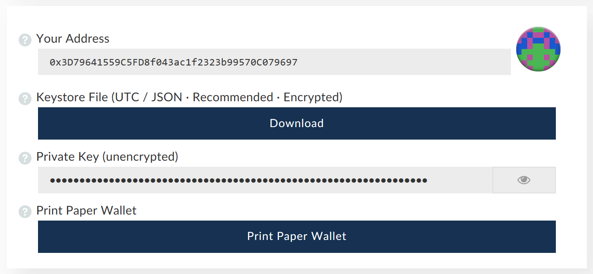

# 以太坊钱包生成

## 什么是钱包

以太坊钱包是一段长度为20字节的地址，该地址由私钥产生：

    私钥 -> 钱包地址

该过程为单向操作，即只能由私钥计算出钱包地址，而不可能从钱包地址逆向出私钥。

因此，要生成钱包，首先要生成私钥。

## 什么是私钥

私钥是一串长度为256位的正整数，私钥的生成即该正整数的生成。本教程将使用MyEtherWallet进行私钥的生成。

## 什么是MyEtherWallet

MyEtherWallet是一个基于浏览器的钱包软件。尽管该软件在浏览器中运行，其私钥生成、交易签名等涉及私钥的操作均完全在本地执行。

针对MyEtherWallet的钓鱼网站非常多，请务必在访问该网站时再三检查网址：

[MyEtherWallet](https://www.myetherwallet.com)

## 使用MyEtherWallet生成钱包

访问MyEtherWallet，在以下位置输入一段密码：

该密码将用于**加密**你的私钥，但私钥本身并不会由该密码产生。输入密码并点击`Create New Wallet`后，会出现以下画面：

点击第一个按钮保存你的`Keystore`文件。该文件包含了刚刚生成的私钥，但是经过先前输入密码的加密。因此，要访问你的钱包，你需要**同时**拥有`Keystore`文件和你的密码。

妥善保存并备份`Keystore`文件后，点击下方按钮继续。

该页面会显示你的**未加密**的私钥，请不要复制或保存该私钥。保存不经加密的私钥十分危险。直接点击下方按钮继续。

接下来，你需要解锁你刚刚保存的`Keystore`文件才能看到自己的地址。在左边选择`Keystore / JSON File`并点击右边出现的`SELECT WALLET FILE...`按钮。

在弹出的文件选择对话框中选择刚刚保存的`Keystore`文件。

输入密码并点击`Unlock`。

成功解锁后便能看到自己的地址。图中的以太坊地址即为`0x3D79641559C5FD8f043ac1f2323b99570C079697`。

地址右侧的图标为以太坊的地址辨识图标。许多钱包软件在转账时会提供该图标，以避免地址输入错误。

至此，以太坊地址的生成已经完成，请妥善保管`Keystore`文件并牢记密码（切勿将密码保存）。