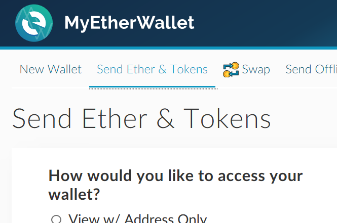
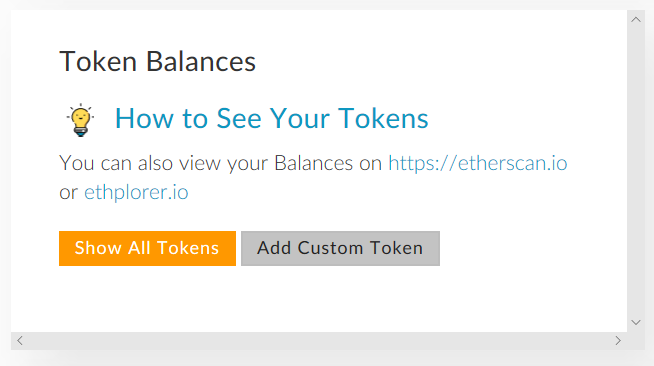
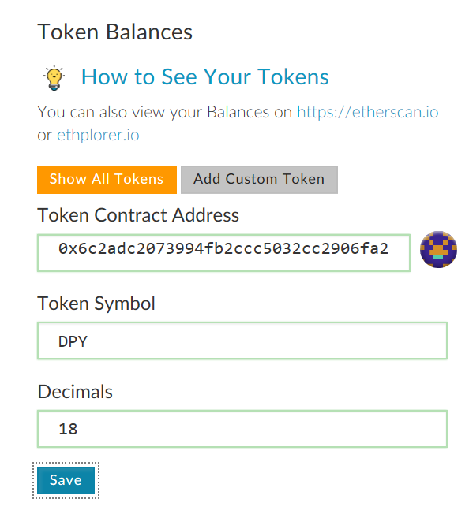
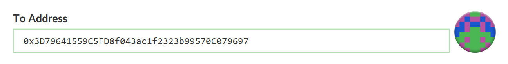
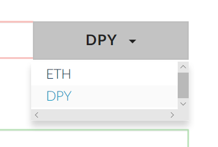
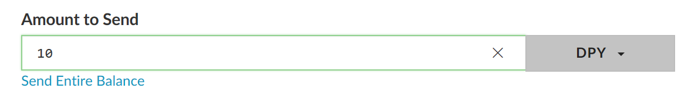
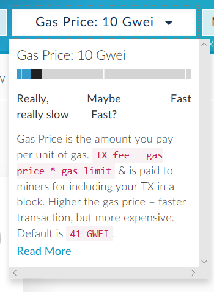
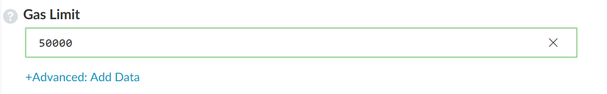
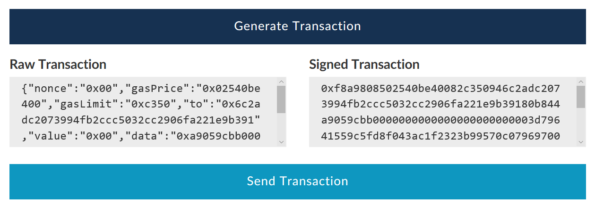
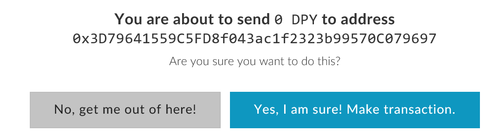

# 使用钱包发送DPY

本教程将使用MyEtherWallet进行演示，其他钱包软件的操作流程与之类似。

## 钱包生成

要使用钱包接收或发送DPY，你首先要拥有一个以太坊钱包。以太坊钱包的生成请参考[该教程](.\WalletGeneration.MD)。

## 添加DPY代币信息

要接收或发送DPY，钱包首先要知道DPY的信息。进入MyEtherWallet，点击`Send Ether & Tokens`并解锁钱包：

*如果不清楚如果解锁，请参考[该教程](.\WalletGeneration.MD)。*

找到Token配置的区域：

点击右方`Add Custom Token`按钮：

在文本框中输入以下信息：

Token Contract Address:

`0x6c2adc2073994fb2ccc5032cc2906fa221e9b391`

Token Symbol:

`DPY`

Decimals:

`18`

点击`Save`保存Token信息。

此后开启该页面时，若账户中由DPY余额，其数值将在此处自动显示。

## 使用钱包发送DPY

发送DPY前，先明确发送的配置：

1. 目标地址

2. 发送金额

3. Gas Price

4. Gas Limit

每次发送前，请仔细检查以上四项配置。

### 目标地址

解锁钱包后，在此处填写目标地址：

### 发送金额

下拉菜单中，将发送的代币从`ETH`切换为`DPY`：

在左侧输入框中输入DPY的金额：

### Gas Price

在MyEtherWallet中，Gas Price的配置通过页面右上角的滑标进行：

### Gas Limit

在金额下方可以输入Gas Limit的数值：

### 交易签名

所有配置检查无误后，点击`Generate Transaction`按钮生成交易：

### 交易广播

交易成功生成后，点击Send按钮：

通过弹出的界面核对以上配置后，点击`Yes. I am sure! Make transaction.`完成交易的广播。